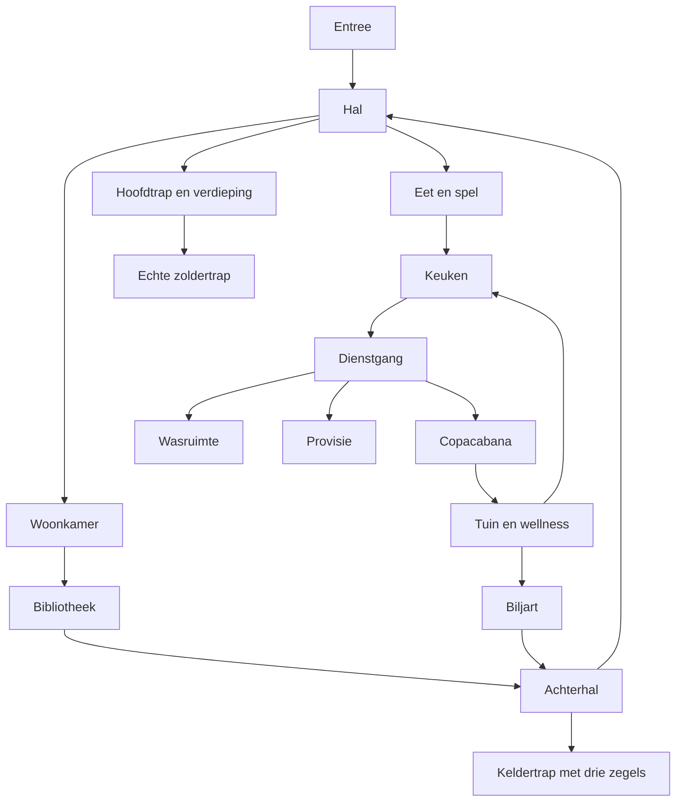
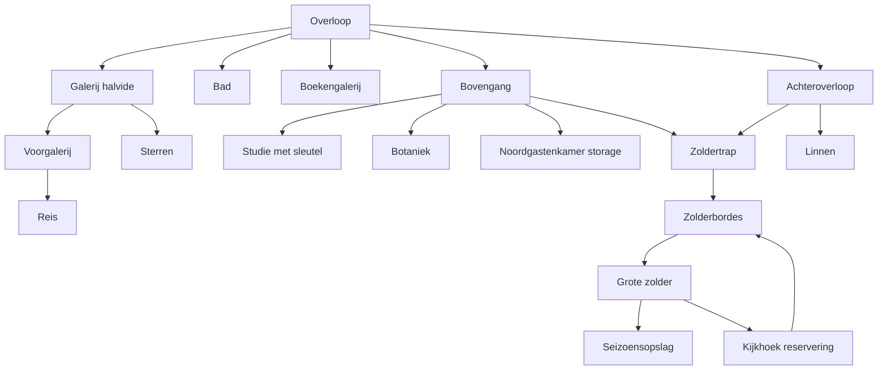

# Feh Lu We — ADJACENCY_GRAPH v0.2

Ontwerp; niet geïmplementeerd. Bronref `ef6b7c3bd9b1bfe56c600b2e76044cf42d919a3a`. Vast: A, terrein 200 × 180 m. Maten staan in LEVEL_LAYOUT.json; buitenedges zijn subsegmenten van een polyline, niet één volledige loop per edge. `out` is de bron-cullingruimte; benoemde buitenzones verfijnen de spelerroute. Alleen fysieke edges gebruiken voor bereikbaarheid.

## Boven en zolder

De drie videverbindingen zijn zichtrelaties, geen beloopbare shortcuts. B01-clusters reis/sterren/botanic zijn bereikbaar vóór studie. Linnen en wasruimte zijn bereikbaar zonder gastenkamer.

## Fysieke room-edges

| A | B | Soort/route | Deur-ID | Voorwaarde |
|---|---|---|---|---|
| `vestibule` | `out` | door | door.front | frontKey; preserve source lock rule |
| `vestibule` | `hall` | arch | — | preserve existing rule / free if no gate |
| `hall` | `living` | arch | — | preserve existing rule / free if no gate |
| `hall` | `dining` | arch | — | preserve existing rule / free if no gate |
| `hall` | `lobby` | arch | — | preserve existing rule / free if no gate |
| `hall` | `landing` | stair | — | preserve existing rule / free if no gate |
| `lobby` | `library` | door | door.library | preserve existing rule / free if no gate |
| `lobby` | `billiard` | door | door.billiard | preserve existing rule / free if no gate |
| `lobby` | `bstair` | door | door.basement | all three seals |
| `bstair` | `bLobby` | arch | — | preserve existing rule / free if no gate |
| `living` | `library` | door | door.livLib | preserve existing rule / free if no gate |
| `dining` | `kitchen` | arch | — | preserve existing rule / free if no gate |
| `kitchen` | `corridor` | door | door.service | preserve existing rule / free if no gate |
| `corridor` | `workshop` | door | door.workshop | preserve existing rule / free if no gate |
| `corridor` | `pantry` | door | door.pantry | preserve existing rule / free if no gate |
| `corridor` | `cons` | door | door.consWest | consKey |
| `workshop` | `out` | door | door.workshopOut | preserve existing rule / free if no gate |
| `billiard` | `out` | door | door.billiardOut | preserve existing rule / free if no gate |
| `kitchen` | `out` | door | door.kitchenBack | preserve existing rule / free if no gate |
| `cons` | `out` | door | door.consEast | consKey |
| `frontGallery` | `walkway` | arch | — | preserve existing rule / free if no gate |
| `walkway` | `landing` | arch | — | preserve existing rule / free if no gate |
| `frontGallery` | `reis` | door | door.reis | preserve existing rule / free if no gate |
| `walkway` | `sterren` | door | door.sterren | preserve existing rule / free if no gate |
| `landing` | `libGallery` | door | door.libGallery | preserve existing rule / free if no gate |
| `landing` | `bath` | door | door.bath | preserve existing rule / free if no gate |
| `landing` | `ucorr` | arch | — | preserve existing rule / free if no gate |
| `ucorr` | `study` | door | door.study | studyKey |
| `ucorr` | `botanic` | door | door.botanic | preserve existing rule / free if no gate |
| `bLobby` | `archive` | arch | — | preserve existing rule / free if no gate |
| `bLobby` | `boiler` | arch | — | preserve existing rule / free if no gate |
| `archive` | `route` | arch | — | preserve existing rule / free if no gate |
| `route` | `tunnel2` | door | door.tunnelManor | lock.tunnelBolt, from tunnel side x<76.85; becomes reachable after plates gate, not finished flag |
| `tunnel2` | `tunnel` | arch | — | preserve existing rule / free if no gate |
| `tunnel` | `gathering` | door | door.tunnelGathering | preserve existing rule / free if no gate |
| `gathering` | `passage` | door | door.gathering | route plates solved |
| `passage` | `entry` | arch | — | preserve existing rule / free if no gate |
| `entry` | `descent` | arch | — | preserve existing rule / free if no gate |
| `descent` | `hut` | arch | — | preserve existing rule / free if no gate |
| `hut` | `out` | door | door.boslust | route restored + cipherStrip + cipher solved |
| `sauna` | `out` | door | door.sauna | preserve existing rule / free if no gate |
| `shed` | `out` | door | door.shed | shedKey |
| `cottageEntry` | `out` | door | door.cottage | preserve existing rule / free if no gate |
| `cottageEntry` | `cottageRoom` | arch | — | preserve existing rule / free if no gate |
| `lobby` | `guestWC` | door | door.guestWC | preserve existing rule / free if no gate |
| `ucorr` | `storage` | door | door.storage | preserve existing rule / free if no gate |
| `rearNookEast` | `linen` | door | door.linen | preserve existing rule / free if no gate |
| `ucorr` | `atticStair` | door | door.atticStair | preserve existing rule / free if no gate |
| `landing` | `rearNook` | arch | — | preserve existing rule / free if no gate |
| `rearNook` | `rearNookEast` | arch | — | preserve existing rule / free if no gate |
| `rearNookEast` | `atticStair` | door | door.atticRear | preserve existing rule / free if no gate |
| `atticStair` | `atticLanding` | stair | — | preserve existing rule / free if no gate |
| `atticLanding` | `atticCommon` | arch | — | preserve existing rule / free if no gate |
| `atticCommon` | `atticStore` | door | door.atticStore | preserve existing rule / free if no gate |
| `atticCommon` | `atticLookout` | arch | — | preserve existing rule / free if no gate |
| `atticLookout` | `atticLanding` | arch | — | preserve existing rule / free if no gate |
| `corridor` | `utility` | door | door.utility | free household room |

## Zicht-/licht-/cullingrelaties

| A | B | Soort/route | Deur-ID | Voorwaarde |
|---|---|---|---|---|
| `hall` | `frontGallery` | arch | — | sight across void; no physical stair connection |
| `hall` | `walkway` | arch | — | sight across void; no physical stair connection |
| `cons` | `out` | glass | — | visibility/light relationship only; source window may be opaque physical wall |
| `libGallery` | `library` | arch | — | sight across void; no physical stair connection |
| `living` | `out` | window | — | visibility/light relationship only; source window may be opaque physical wall |
| `dining` | `out` | window | — | visibility/light relationship only; source window may be opaque physical wall |
| `kitchen` | `out` | window | — | visibility/light relationship only; source window may be opaque physical wall |
| `billiard` | `out` | window | — | visibility/light relationship only; source window may be opaque physical wall |
| `library` | `out` | window | — | visibility/light relationship only; source window may be opaque physical wall |
| `workshop` | `out` | window | — | visibility/light relationship only; source window may be opaque physical wall |
| `pantry` | `out` | window | — | visibility/light relationship only; source window may be opaque physical wall |
| `vestibule` | `out` | window | — | visibility/light relationship only; source window may be opaque physical wall |
| `reis` | `out` | window | — | visibility/light relationship only; source window may be opaque physical wall |
| `sterren` | `out` | window | — | visibility/light relationship only; source window may be opaque physical wall |
| `study` | `out` | window | — | visibility/light relationship only; source window may be opaque physical wall |
| `botanic` | `out` | window | — | visibility/light relationship only; source window may be opaque physical wall |
| `bath` | `out` | window | — | visibility/light relationship only; source window may be opaque physical wall |
| `landing` | `out` | window | — | visibility/light relationship only; source window may be opaque physical wall |
| `frontGallery` | `out` | window | — | visibility/light relationship only; source window may be opaque physical wall |
| `libGallery` | `out` | window | — | visibility/light relationship only; source window may be opaque physical wall |
| `cottageEntry` | `out` | window | — | visibility/light relationship only; source window may be opaque physical wall |
| `cottageRoom` | `out` | window | — | visibility/light relationship only; source window may be opaque physical wall |
| `linen` | `out` | window | — | visibility/light relationship only; source window may be opaque physical wall |

| `storage` | `out` | window | — | behouden bronlicht/culling; geen echte apertureclaim |

## Buitenroute-edges

| A | B | Soort/route | Deur-ID | Voorwaarde |
|---|---|---|---|---|
| `gate` | `arrivalCourt` | arrival | — | free intended arrival |
| `arrivalCourt` | `vestibule` | arrival | — | door.front/frontKey |
| `arrivalCourt` | `parkingWest` | shared maneuver apron | — | free |
| `arrivalCourt` | `parkingEast` | shared maneuver apron | — | free |
| `arrivalCourt` | `shed` | shedRoute | — | door.shed key only at building |
| `shed` | `fire` | shedFire | — | free; intended C evidence |
| `fire` | `mainTerrace` | fireReturn | — | free |
| `fire` | `fork` | southLoop | — | free |
| `fork` | `hut` | boslustApproach | — | door.boslust/cipher at hut |
| `well` | `arrivalCourt` | eastLoop | — | free |
| `well` | `wickerman` | wickermanLoop | — | optional |
| `wickerman` | `eastPathReturn` | wickermanLoop | — | optional return at source eastLoop (113,62.5) |
| `shed` | `golfTee` | golfLoop | — | optional |
| `golfTee` | `arrivalCourt` | golfLoop | — | optional, north side of hill |
| `billiard` | `mainTerrace` | door.billiardOut | — | free |
| `kitchen` | `mainTerrace` | door.kitchenBack | — | free |
| `mainTerrace` | `bbq` | bbqApproach | — | free |
| `mainTerrace` | `outdoorDining` | social deck | — | free |
| `mainTerrace` | `musicBong` | social deck | — | free |
| `mainTerrace` | `lanternLawn` | terraceLanterns | — | free |
| `mainTerrace` | `cottageTerrace` | cottageOut | — | optional |
| `cottageTerrace` | `cottageEntry` | cottageThreshold | — | door.cottage, free |
| `cottageTerrace` | `lanternLawn` | cottageReturn | — | optional |
| `lanternLawn` | `lakeView` | lakeViewRoute | — | optional |
| `lanternLawn` | `eastGlade` | eastGardenLoop | — | optional |
| `eastGlade` | `wellness` | eastGardenLoop | — | optional |
| `cons` | `wellness` | door.consEast | — | consKey/shared lock, double leaf |
| `wellness` | `sauna` | wellness | — | ramp to FY.8; board access |
| `wellness` | `jacuzziPad` | jacuzziApproach | — | optional, no evidence |
| `eastPathReturn` | `arrivalCourt` | eastLoop | — | free via existing northeast forecourt branch |
| `sideGate` | `well` | eastLoop | — | local side gate landmark, no new game gate |
| `arrivalCourt` | `arrivalService` | shared maneuver apron | — | free loading route |
| `musicBong` | `balloonNook` | social deck | — | separate prop nook |

## Verticale en gate-contracten

S01 hal→landing; S02 bstair→bLobby; S03 atticStair→atticLanding; S04 hut/descent→entry. Hoogtes, vluchten en bordessen staan in JSON. Dubbele consEast heeft één logische opgeslagen deurstand en het bestaande gedeelde slot; sauna wordt via topbordes+helling bereikt op +0,80. Cottage behoudt door.cottage en haar twee room-IDs op +4,15. De late tunnel wordt fysiek toegankelijk na routeplaten, niet pas na finished. Startlade/schuur/vuur en C-kennisroute zijn geen nieuw afgedwongen clueflag-gates.

Broncontrole: 49 expliciete + 19 gegenereerde window-portals = 68. Audit §3.2 vermeldt 51 expliciet; deze revisie gebruikt de gecontroleerde broncount. Alle bronrelaties zijn behouden; uitbreidingen zijn afzonderlijke ontwerp-edges.
