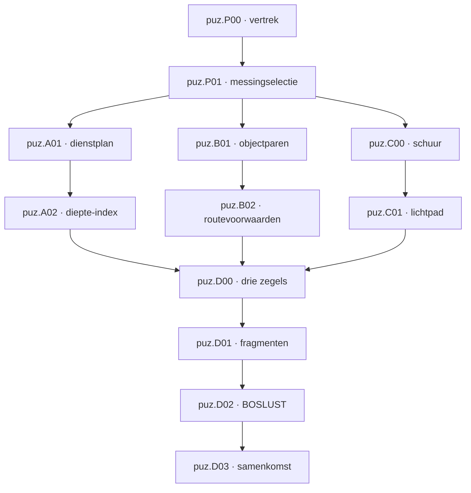
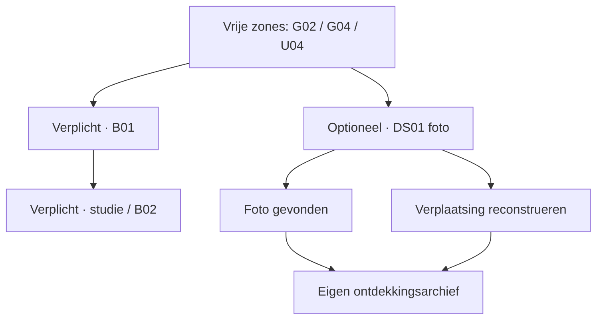
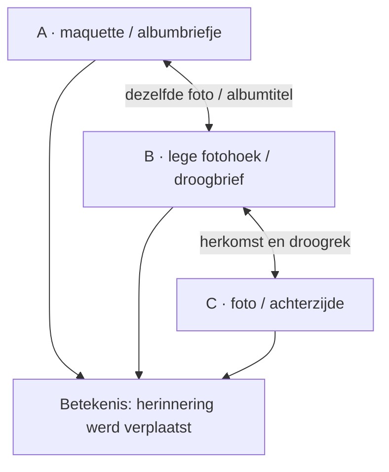

# Feh Lu We — Puzzle Design v0.2

Datum: 7 oktober 2026. Status: geïntegreerd ontwerpvoorstel op basis van Omars besluiten in deze opdracht; geen implementatie, publicatie of bewezen speelervaring. Dit document vervangt de ontwerpgraph, B01-keuze, optionele contentcontracten en timing uit v0.1. De broncode-audit van v0.1 blijft historische inspectie, niet een actuele buildclaim.

## 1. Besluiten, bronnen en grenzen

Feh Lu We gaat over de Veluwe-weekenden van **Thunder Muffin (VW/TM)**; de speler is een groepslid. De richting is verkennen en geleidelijk ontdekken, met warm mysterie en speelse raadsels. Persoonlijke voorkennis is nooit noodzakelijk voor verplicht of optioneel puzzelbegrip. Herkenning kan wel extra betekenis geven.

### 1.1 Vastgelegd voor deze versie

1. Drie vrije hoofdsporen; elk heeft een andere dominante denkactiviteit.
2. Een formele tweede laag: ontdekkingssporen van 2–3 locaties, kamerraadsels en omgevingsvondsten.
3. Optionele content levert geen vereiste finale-informatie, item, toegang of voortgangsvlag. Ook geen unieke uitleg van een verplicht mechanisme.
4. Een latere schakel mag eerst worden gevonden. Vondst en betekenis blijven dan geldig; eerdere schakels kunnen achteraf verklaren wat ermee gebeurde.
5. B01 gebruikt uitsluitend **fysieke objectdetails/objectparen → archiefclip → vak**. Geen parallel werkmap-/embleemsysteem.
6. B02 wordt deductie op een expliciet gedefinieerd routebord; C wordt een zichtbaar lichtpad; drie routefragmenten vormen de kelder-synthese; de laatste verplichte platenkopie vervalt.
7. Deze opdracht levert ontwerp en afstemmingscontracten. Geen spelcode wijzigen.

Exacte optionele teksten, C-geometrie en de B02-framing hieronder zijn nieuwe uitwerkingen binnen die besluiten, geen eerder goedgekeurde assets of echte anekdotes. Het grotere huisgeheim en de inhoud van de uiteindelijke onthulling blijven open bij Spelvisie & integratie.

### 1.2 Geraadpleegde documenten

- `Feh_Lu_We_Puzzle_Design_v0.1(1).md`: 58.412 bytes; eerdere audit op commit `338e65617e51385bae557f573ba092af5a10f89d`.
- `LEVEL_PLAN.md`, v0.1: 6 oktober; voorstel met centrale hal, twee lussen, optionele zolder en meertje/huisje. De oude B01-werkmaproute en oude C/finalecontracten conflicteren met deze opdracht.
- `ENVIRONMENT_STORY(1).md`, v0.1: Thunder Muffin, fysieke B01-clusters, persoonlijke feiten versus fictie, G.M. als gewenste fictieve aanduiding, bewust toegestane Copacabana-bordjes.
- `UX_GAME_FEEL(1).html`: één contextactie en actieve overlay, ruwe bronkopieën, vrijwillige hulp, geen automatische bewijskoppelingen, input-/draftbehoud.
- Omars expliciete integratiebesluiten in deze opdracht en de eerdere toelichting over kleine losse sporen.

De bestanden zijn voor deze versie gelezen. Geen afzonderlijke actuele CORE_BRIEF/DECISIONS-versie kon worden bevestigd. Daarom zijn de expliciete besluiten hierboven het gezag voor v0.2; oudere disciplinevoorstellen zijn input, geen uitvoeringsopdracht. Geen nieuwe repository- of live-buildinspectie in deze beurt. De documenten verwijzen naar verschillende inspectiebases; de toekomstige uitvoerder moet actuele HEAD en relevante verschillen vastleggen.

### 1.3 Eén genrekeuze die nog aandacht vraagt

De G.M. kan het speelse voorbereidingswerk verklaren; dat verklaart niet automatisch het oudere huisgeheim. De huidige zegels, routefragmenten en decoder ondersteunen progressie, maar bewijzen nog geen inhoudelijk overtuigende onthulling. Integratie moet bepalen wat de fragmenten in het verhaal werkelijk vertegenwoordigen. Houd die open vraag zichtbaar; schrijf niet alvast verzonnen geschiedenis van bewoners of vrienden in de clues.

## 2. Twee lagen van spelinhoud

De termen zijn werktermen voor ontwerp en registratie. Definitieve spelerstitels volgen de inhoud, niet het systeemtype.

| Type | ID-namespace | Omvang en kernactiviteit | Beloning | Relatie met finale |
|---|---|---|---|---|
| Hoofdspoor | `puz.A/B/C.*` | Twee samenhangende activiteiten; één dominante denkactiviteit | Zegel + routefragment, soms toegang | Vereist |
| Ontdekkingsspoor | `opt.DS.*` | 2–3 locaties; een vraag volgen en een verplaatsing/situatie reconstrueren | Vondst, betekenis, optionele registratie | Geen vereiste relatie |
| Kamerraadsel | `opt.KR.*` | Eén ruimte; één inzicht/manipulatie | Kleine verandering, verborgen vak of observatie | Geen vereiste relatie |
| Omgevingsvondst | `opt.OV.*` | Observeren; eventueel één inspectie | Herkenning, sfeer, humor | Geen vereiste relatie |

**Eerste contentbudget:** 2 ontdekkingssporen, 3 kamerraadsels, enkele geselecteerde omgevingsvondsten. Alleen DS01 wordt hier volledig gespecificeerd; het bestaande optionele biljart is kandidaat KR01. DS02 en KR02/KR03 blijven lege reserveringen zonder locaties, fictieve anekdotes of bouwopdracht. De vertical slice bevat slechts B01 + DS01. Geen quotum per kamer.

### 2.1 Verplichte ontwerpregels voor optionele inhoud

- Iedere schakel heeft lokale betekenis en bewaart herkenbare herkomst. Geen onduidelijk voorwerp dat alleen begrijpelijk wordt na een verborgen startbrief.
- Verwijzingen mogen richting geven; iedere verplaatsing heeft een begrijpelijke oorzaak. Niet drie briefjes met alleen 'ga naar de volgende plek'.
- Een latere vondst ontgrendelt eerdere evidence niet en vernietigt die niet. Geen 'quest gestart'-gate op zichtbaarheid, interactie of beloning.
- Het systeem vereist geen juiste bezoekvolgorde, geen terugbrengen van het object en geen volledige cluechecklist voor erkenning van de vondst.
- Gemiste optionele inhoud verandert geen verplichte validator, sleutel, decoderregel, zegel, routefragment of eindvlag.
- Essentiële hoofdroute-informatie hoort zichtbaar en volledig in de hoofdlaag. Een optioneel cipherbriefje mag hoogstens reeds beschikbaar bewijs herhalen; in deze versie is het decodervoorbeeld daarom verplicht onderdeel van de decoder zelf.
- Alleen reeds gevonden content verschijnt in het ontdekkingsarchief. Geen totaal '3/12 geheimen', verborgen oplossingstitels, ongevraagde waypoint of completionistscore als standaard.
- De speler mag na de finale verder verkennen. Geen verdwenen props of onbereikbare optionele kamer door het einde.

## 3. PUZZLE_GRAPH v0.2 — hoofdroute

### 3.1 Namespaces en soorten afhankelijkheid

`puz.B01` is de bibliotheekpuzzel; `loc.B01` is het kelderportaal uit het levelplan. Gebruik altijd namespace om deze gelijknamige IDs niet te verwarren. Locatie-IDs hieronder volgen LEVEL_PLAN als reservering, niet een claim van gebouwde geometrie. `loc.shed`, `loc.boslust.entry` en `loc.lightRig` zijn subzones die leveldesign nog expliciet aan records moet koppelen.

- **F:** fysieke toegang, zicht-/interactiepositie, deur of lichtconditie.
- **I:** itembezit, geïnstalleerd eigendom of beschikbare paneelstukken.
- **K:** bewijs dat een speler nodig heeft om af te leiden; geen verplichte inspectievlag.
- **P:** persistente voortgang/beloning en echte gates.

P00 en P01 leiden tot de drie hoofdsporen. Vrijheid betekent alle 6 voltooiingsvolgorden en kunnen wisselen bij vastlopen. Vrij toegankelijke vroege A/B-clues hoeven niet verborgen te zijn totdat P01 klaar is. Het register introduceert de structuur; het is geen onzichtbare codevoorwaarde op al bereikbare panelen.



Pijlen tonen de bedoelde progressielijn. De getypeerde matrix bepaalt de echte gate; kennis mag eerder beschikbaar zijn.

### 3.2 Uitvoerbaar dependency-contract

| ID | F: locatie/toegang | I: items | K: volledige bewijsset | P: gate / resultaat |
|---|---|---|---|---|
| puz.P00 | Thuis tafel/dressoir/deur | 5 benodigdheden voor vertrek | Bediening, uitnodiging, deurfeedback | `leftHome` |
| puz.P01 | loc.G02 console + loc.G03 mantel | Geen | Uitnodiging + alle 6 mantelprops/dragers + kijkrichting | Register + schuursleutel |
| puz.A01 | loc.G05/G06 | 3 lokale labels | Dienstregel + labelinhoud | Serresleutel |
| puz.A02 | loc.G13 + sauna; gedeelde serregate | Serresleutel | 4 mozaïeken + diep/ondiep + 1–4-index | Bundel tafelzegel + fragment A |
| puz.B01 | loc.G04, loc.U04/U05/U10 vrij toegankelijk | 3 lokale folio's | Foliodetails + 3 fysieke objectparen/clips + lokale oefenkaart | Studiesleutel |
| puz.B02 | loc.U09 achter studieslot | Studiesleutel | Routebord + volledige voorwaarden + telvoorbeeld | Bundel archiefzegel + fragment B |
| puz.C00 | loc.shed achter schuurslot | Schuursleutel; zaklamp waar vereist | Gereedschaps-/instructiebord | Voedingshendel + lichtkaart, één bundel |
| puz.C01 | loc.lightRig in loc.E06; altijd bereikbaar | Hendel geïnstalleerd | Lokale banen, vaste ingangen, draaibare uitgangen + kaart | Bundel spoorzegel + fragment C |
| puz.D00 | loc.G07 kelderdeur | 3 zegels, `owns` ook installed/used | Register/3 afdrukken | Kelder open; zegels blijven eigendom |
| puz.D01 | loc.B04 routeframe | 3 fragmenten | Eindpunten + vaste bovenkant + start/eindanker | Route compleet + decoderbundel |
| puz.D02 | loc.boslust.entry bereikbaar, ook vroeg | Decoderbundel met metalen lip | Tablet + alfabetten + −3-voorbeeld op strip | BOSLUST open |
| puz.D03 | loc.X04/X05 | Geen | Aangesloten lijnmotief en duidelijke hendel | Gang open → brief gelezen → eindvlag; late terugtunnel |

**Verbod:** geen `opt.*`-ID mag voorkomen in I/K/P van deze matrix. Geen indirecte gate via een optioneel geopend kastje, foto of ruimte.

### 3.3 Verschil in denkactiviteit

| Hoofdspoor | Dominante activiteit | Niet uitbreiden met |
|---|---|---|
| A | Concrete relaties/eliminatie, daarna referentierichting toepassen | Nog meer letterlijke symboolvolgordes |
| B | Twee details vergelijken/provenance bepalen, daarna voorwaarden combineren | Een tweede embleemwoordenboek of kamernaamraadsel |
| C | Experimenteren met zichtbare continuïteit en manipulatiefeedback | Een geheime aansteekvolgorde of onverklaarde lichtfysica |

De hoofdsporen hoeven niet elk een exclusief mechanisme te gebruiken. Het verschil zit vooral in het denkproces en de feedback. Zo blijven bestaande placement-controls bruikbaar zonder drie nieuwe UI-systemen te bouwen.

## 4. Verplichte puzzle specs v0.2

Alle volgende antwoorden zijn designerspoilers. Geen gewone doeltekst of inspectietekst berekent ze alvast. Drie hintniveaus blijven vrijwillig: aandacht, relatie, oplossing. Geen foutstraf, timer, cooldown of verplichte prefixfeedback bij codes.

### 4.1 Behouden korte activiteiten

| ID | Spelersvraag en afleiding | Exact antwoord/invoer | Feedback/beloning | 3 hints |
|---|---|---|---|---|
| P00 | Welke spullen ontbreken? Verzamel uitnodiging, zaklamp, lucifers, notebook en estatesleutel | 5 pickups → voordeur | Tasupdate, vertrek; deur noemt ontbrekende | Tafel/dressoir / vijf benodigdheden / pak vier tafelspullen en ladesleutel |
| P01 | Welke dragers horen bij lade? Filter 6 mantelprops op messing, lees vóór haard links→rechts | Veer–Dennenappel–Kopje; 3 wielen + Proberen | Neutrale fout; lade open met register/schuursleutel | Vergelijk dragers / alleen messing, juiste kijkrichting / antwoord |
| A01 | Welke wagen hoort waar? Koud→provisie; bloemen→serre; overblijver→tafel | Melk/kaas=provisie; gieter/tulp=serre; terrine=tafel; placement + bevestigen | Labels herstelbaar; luik met serresleutel | Dienstregel / direct toewijzen dan elimineren / volledige mapping |
| A02 | Vanaf welke kant telt onderhoudsdiagram? Trapje is ondiep, diagram start diep | 1 Ruit, 2 Golf, 3 Driehoek, 4 Cirkel; 4 wielen + Open kast | Kast open, zegel/fragmentbundel | Sauna-index / 1 bij diep / volledige rij |

Mantelkopie bewaart alle zes props en dragers. Dienstpaneel benoemt beginpunt/taak zodat 'vertrekt uit' geen onnodige ambiguïteit geeft. A02 gebruikt een onderhoudsindex; de oude stoommetafoor verdwijnt. Beide serredeuren delen één gate, ook bij gewenste dubbele buitenklapdeur. De naam **Francois' Copacabana Room** is een toegestane persoonlijke bordjesuitzondering en geen codebewijs.

### 4.2 B01 — één bewijsroute: objectpaar → clip → vak

**Vraag:** bij welk archiefvak hoort ieder los tekenfolio? **Beloning:** studiesleutel, met vervolgkaart die naar studie verwijst maar geen B02-antwoord geeft.

| Folio-ID | Exacte fysieke details op tekening én bovencluster | Locatie | Clip / vak |
|---|---|---|---|
| `EB.folio.stars` | Telescoop op vorkvoet met twee ronde schroefkoppen; gesloten schrift met drie gaten naast elkaar | loc.U05 | Ronde clip aan schrift → rond |
| `EB.folio.plants` | Geperste varen onder glas met één brede diagonale reparatiestrook; schaar met één hoekige en één ronde greep | loc.U10 | Puntige clip aan glasplaat → punt |
| `EB.folio.travel` | Koffer met twee parallelle riemen en vierkante middenpatch; label met afgesneden rechterbovenhoek | loc.U04 | Vierkante clip door labelgat → vierkant |

**Letterlijke instructie:** 'Deze losse tekenbladen horen bij drie objectgroepen boven. Vergelijk beide getekende details met hun originelen. De archiefclip aan de passende groep heeft de vorm van het juiste vak. Een losse overeenkomst is niet genoeg.'

**Lokale oefenkaart:** sleutel met drie tanden + gestreepte koordlus; beide originelen liggen ernaast met golftab. Getekend oefenvak golftab, niet een vierde verplicht slot. De oefening leert het verband voordat drie matches worden gecombineerd.

**Afleiding:** herken beide details → controleer echte groep → lees fysiek bevestigde clip → kies dezelfde vakcontour. Algemene kamerfunctie helpt zoeken, maar is geen bewijsschakel. Geen eisen aan de naam die de speler de kamer geeft.

**Invoer:** selecteer folio, selecteer vak; terugnemen/swappen; beoordeel volledige set met 'Controleer'. Exacte mapping: `rond=stars`, `punt=plants`, `vierkant=travel`. Onvolledig geen foutpoging; compleet verkeerd neutraal; goed lade zichtbaar open. 6 complete permutaties, dus geen robuuste gokbarrière; test of vergelijken aantrekkelijker is dan proberen.

**Hints:** 1 'Zoek boven de objectgroepen uit de tekeningen.' 2 'Vergelijk beide details; de clip aan de juiste groep bepaalt het vak.' 3 'Telescoopfolio rond, varenfolio puntig, kofferfolio vierkant.'

**Verwijderen uit de nieuwe keten:** boekcoveremblemen als invoerbewijs, werkmappen met overeenkomstig embleem, gastenboek kamer→tab, plattegrond embleem→kamer en bordjeshints. De gewone kaart blijft navigatiekaart; geen tweede antwoordenlijst. Decoratieve sterren/planten/koffers mogen bestaan, maar nooit het volledige unieke detailpaar dupliceren.

**UX-contract:** één inspectiecluster per paar, vergrote ruwe afbeelding plus letterlijk detailtranscript; geen 'dus folio naar rond'. Wereld, folio, notitie en assetfixture komen overeen. Koffer/label blijven ook na optionele DS01-bezoeken intact. B01-folio's zijn lokale placementstukken, geen los optioneel foto-item in hetzelfde paneel.

### 4.3 B02 — routevoorwaarden, geen gefingeerde as-built kaart

V0.1 gebruikte een huisje/zijheknetwerk dat niet als echte estate-topologie was vastgesteld. V0.2 maakt de framing expliciet: **een klein abstract routebord op het studiebureau, met bekende landgoedmotieven**, getiteld 'Wandelroute-oefening'. Het is geen navigatiekaart van huidige paden en geen belofte dat de speler fysiek naar het huisje moet. Het huisje blijft optioneel bezoek.

**Vraag:** welke route voldoet aan alle voorwaarden? **Bewijs:** vijf benoemde knopen, zeven ongerichte verbindingen; geen verborgen of overlappende verbindingen. Motieven: Put, Schuur, Vuurplaats, Huisje, Zijhek. Domein telt padstukken, niet meters.

**Netwerk:** Put–Schuur; Schuur–Vuurplaats; Vuurplaats–Huisje; Put–Vuurplaats; Schuur–Huisje; Put–Zijhek; Zijhek–Huisje.

**Letterlijke voorwaarden:** 'Begin bij de put en eindig bij het huisje. Neem precies drie verbindingen. Bezoek geen plek tweemaal. Het zijhek is uitgesloten. Bezoek de schuur vóór de vuurplaats.' Daarmee moeten beide genoemde tussenplekken voorkomen. Een neutraal X–Y–Z-demo leert 3 stops = 2 verbindingen.

**Afleiding:** zonder zijhek blijven voor drie verbindingen twee simpele routes: Put–Schuur–Vuurplaats–Huisje en Put–Vuurplaats–Schuur–Huisje. Alleen de eerste voldoet aan schuur vóór vuurplaats. Twee-verbindingroutes zijn te kort. **Antwoord:** Put → Schuur → Vuurplaats → Huisje.

**Invoer:** tik landmarks; teken route; vaste start/eind; verwijder laatste stap/Wis; Toets route. Onverbonden stap is ongeldig invoer, niet een geheime afleidingshint. Foutmelding voor volledige route: 'Deze route voldoet niet aan alle voorwaarden.' Geen locatiewaypoint of gewijzigde fysieke hekstate.

**Succes:** bureaulade open → archiefzegel + fragment B atomair beschikbaar. **Hints:** telvoorbeeld en voorwaarden / schuur vóór vuur, 4 stops / exacte route. **Gokruimte:** slechts twee relevante kandidaten vóór volgordevoorwaarde, niet '625 mogelijkheden'. Deze korte deductie is geen hoofdbreinbreker; claim geen moeilijkheid op basis van combinatoriek.

**Trade-off:** de oefening is eerlijker en begrensder, maar minder natuurlijk dan een echt archiefdocument. G.M.-voorbereiding is de voorlopige fictieve context. Als integratie een historische wandeling verlangt, moet leveldesign eerst de echte routekaart en unieke oplossing samen herontwerpen; niet het abstracte netwerk als werkelijk terrein labelen.

### 4.4 C00/C01 — zichtbaar lichtpad, exact authoringcontract

**Wijziging:** vervang de onduidelijke 'voedingstang' door één **voedingshendel** met unieke passende koppeling aan het kleine tuinapparaat. Het is een ontworpen lichtinstallatie met afgedekte geleidingsbanen; geen klus met echte elektriciteit, brandstof of tijdslimiet. Hendel eenmaal vastzetten activeert een persistente bron. C00 is toegang en voorbereiding, geen tweede denkpuzzel.

**C00 bewijs:** schuurkaart: 'De losse hendel hoort in de voedingsvoet bij de maanlantaarn. De ingangen staan vast. Draai de uitgangen zodat de lijn naar de volgende ingang doorloopt.' Hendel/kaart één pickupbundel. Geen verplichte brandhout-, vuur- of koperplaatketen; die oude clues/hints niet laten voortbestaan als concurrerende instructie. Vuur is alleen optionele sfeerhandeling als de bestaande veilige spelinteractie wordt behouden.

**C01 vraag:** hoe loopt de zichtbare lijn van bron naar centrale ontvanger? Gebruik orthogonale lokale opstelling zodat richtingen werkelijk kloppen; geen gebogen onzichtbare lichtstraal.

| Onderdeel | Lokale positie (u,v), meter | Vaste ingang | Juiste uitgang | Startuitgang |
|---|---|---|---|---|
| Maan | (−3,0) | W, voedingsvoet | N | Z |
| Blad | (−3,3) | Z, ontvangt Maan | O | N |
| Zon | (0,3) | W, ontvangt Blad | Z | O |
| Middenontvanger/steen | (0,0) | N, ontvangt Zon | Geen | Geen |

Lokale N is +v en O is +u; authoringdescriptor bevat rotatie/vertaling naar terrein. Druk dezelfde roos op apparaat en inspectie; de lokale N is geen belofte van geografisch noord. Vier kwartslagstanden per uitgang. Ingang blijft een aparte, onbeweeglijke connector; speler draait die niet mee. Banen Maan–Blad–Zon–Midden zichtbaar, met herkenbare eindpunten; overige uitgangen eindigen op korte zichtbare blindstops, zonder routeclues.

**Exact antwoord:** Maan=N, Blad=O, Zon=Z. Dit vervangt de W-eindstand uit v0.1, omdat het nieuwe orthogonale diagram werkelijk naar het midden loopt. Indien leveldesign rig roteert, blijven lokale standen gelijk. Plaatsing buiten deze descriptor verandert de oplossing alleen via versie-update met bewijs/hints/tests.

**Afleiding:** vind bron → zie vaste ingang van Blad boven Maan → draai Maan naar N → Blad naar Zon rechts → O → Zon naar midden beneden → Z. Een oefenpaar op kaart leert vaste ingang/draaibare uitgang. Geen aansteekvolgorde, vrij mikken, mirrors of physicsraytracing.

**Invoer:** tap een uitgang kwartslag klokwijs; laat gekozen richting zichtbaar; 'Test lichtpad' start een korte visuele puls. Getoonde lijn stopt bij eerste onderbreking, tekst benoemt hetzelfde bereik. Geen reset van standen, tijdelijke stroom of brandstofverlies. Vooraf draaien mag; zonder hendel: 'De voedingsvoet mist zijn hendel.'

**Feedback/beloning:** volledige keten licht midden op → steen open → spoorzegel/fragment C. Partiële feedback is bewust experiment, geen exploit van verborgen codeprefix. 64 volledige standen; door lokale feedback hooguit 12 standproeven. Test of speler continuïteit begrijpt in plaats van alleen rondtapt.

**Hints:** bron/ontvangers bekijken / van Maan één verbinding tegelijk, ingang staat vast / N–O–Z op lokale roos. Geen veld waarin N–O–Z als geheime tekstcode moet worden ingetypt.

### 4.5 D00/D01 — drie bundels worden één route

**D00:** drie zegels zijn inventarisgate op kelderdeur; ontbrekende bij vorm benoemen. Geen nieuwe vakkenpuzzel. `owns` omvat gedragen, geplaatst en used; geen verbruik.

**Bundelcontract:** het einde van A/B/C levert zegel en bijbehorend routefragment in één idempotente transactie. Openen, ophalen en opslaan zijn herstelbaar. Geen kleine tweede papierpickup die gemist kan worden. Item-ID's: `main.seal.A/B/C`, `main.fragment.A/B/C`.

**D01 bewijs:** kelderframe met haardanker links, wortelanker rechts, vaste bovenkant met dakrand. Fragment B draagt haard→één knoop, A één knoop→twee knopen, C twee knopen→wortels en het opschrift BOSLUST. Het zijn diagramfragmenten, geen exacte topografische kaart. BOSLUST mag al bij fragment C worden ontdekt; een vroege bestemming is geen toegangsbypass.

**Afleiding/invoer:** begin bij haard → match eindpunt één knoop → twee knopen → wortels; leg B–A–C, geen rotatie, bevestig 'Verbind'. 6 permutaties. Dit is korte synthese/payoff, geen nieuwe zware matchingpuzzel.

**Succes:** lijn loopt door, werkelijke bestemming wordt aangegeven op een afzonderlijke estatekaart, decoder met metalen lip verschijnt als één item. 'BOSLUST gevonden' is niet hetzelfde als 'BOSLUST open'. Geen verplicht huisje-/foto-/omgevingsraadsel om de bestemming te leren.

**Hints:** begin bij haard / gelijke randknooppunten / B links, A midden, C rechts.

### 4.6 D02/D03 — aangeleerde toepassing, daarna landing

**D02:** decoder heeft twee gelabelde alfabetten, terugpijl en verplicht beschikbaar voorbeeld DEF→ABC inclusief wrap. Dit onderwijs zit op de decoder, niet in een optioneel boek. Vrijwillig oefenvak YLHU→VIER kan bestaan, maar niet nodig om het principe te krijgen. Library note is aanvullend/herhalend.

Metalen lip schuift de kleppal vrij; karton is geen mechanische sleutel. Tablet `WZHH YLHU HHQ GULH` → −3 → TWEE VIER EEN DRIE → **2413**. Vier cijfers + Proberen; neutrale fout, geen prefix. Correct open deur/echte trap. Tablet mag vóór decoder worden bekeken en geregistreerd. Hints: strip naast tekst / drie terug, YLHU=VIER / 2413.

**D03:** hendel verbindt de platen automatisch, warme zaal toegankelijk; lezen van slotbrief voltooit spel. Geen draai-inputs, laatste code of optionele verzameling als voorwaarde. De bestaande tafel/boek/boomplaten kunnen als visuele drie-eenheid blijven. Tunnelgrendel pas vanuit finale bereikbaar; geen omloop vóór D02. De verhaalonthulling is nog te schrijven, met eigen bewijsreview vóór canonisering. Een tijdelijke brief mag niet suggereren dat v0.2 het grotere geheim al heeft opgelost.

## 5. Verplichte versus optionele graph

### 5.1 Twee graphs, geen terugpijl naar verplicht



ACCESS is gedeelde fysieke ruimte, geen logisch puzzle-item. DS01 bevat geen pijl naar studie, zegel, fragment, decoder of eindvlag. Ook zijn optional items niet selectable in verplichte placement-panels.

### 5.2 Optionele registratiegraph

| ID | Type en plaats | F/I/P | K / resultaat | Scope |
|---|---|---|---|---|
| opt.DS01 | 3 locaties: G02 hal → G04 bibliotheek → U04 reiskamer | Alleen vrij bereikbare zones; geen item/P-gate | Foto vinden; verplaatsing reconstrueren, onafhankelijk van volgorde | Volledig gespecificeerd hieronder |
| opt.DS02 | Ontdekkingsspoor, 2–3 locaties | Nog te definiëren | Geen finale-informatie | Reservering, niet bouwen |
| opt.KR01 | Kamerraadsel, G08 biljart | Geen hoofditem/gate | Voorbeelden + bovenaanzicht → 3×3 cells 0,5,8; optionele vondst | Bestaande kandidaat; geen nieuw uitgewerkt verhaal |
| opt.KR02/03 | Kamerraadsels | Nog te definiëren | Lokaal inzicht; geen hoofdroutebeloning | Reserveringen |
| opt.OV01 | G02 gingerbread-maquette | Vrij, inspectie optioneel | Eerste huisnaam, feitelijke persoonlijke herkenning | Onderdeel DS01-locatie A, geen verplichte clue |
| opt.OV02 | Copacabana-bordjes/scene | Serretoegang kan volgen uit A; bezoek is geen extra finale-eis | Naam en persoonlijke scène | Naam expliciet toegestaan |
| opt.OV03 | Zelfgemaakt bordspel in G05 | Vrij | Herkenning groepsactiviteit, geen verzonnen spelregels | Omgevingscontent, geen code |

Een optionele scène mag achter een normale hoofddeur liggen als bezoek daar eerlijk op aansluit. DS01 ligt bewust volledig vóór studieslot en kan in de eerste slice zonder B01-oplossing worden afgerond. De complete hoofdroute moet werken met alle `opt.*` states false.

### 5.3 Kennislinks van DS01 zijn bidirectioneel



Dit toont semantische links, geen vereiste bezoekvolgorde. In alle 6 encountervolgorden blijven props, ruwe observaties en beloning geldig.

## 6. Volledige optional-discovery spec — opt.DS01

### 6.1 Identiteit en bedoeling

**Werknaam:** 'De foto die moest drogen'. Spelerstitel verschijnt pas bij foto-inspectie; daarvoor alleen letterlijke brontitels. **Vraag:** 'Waar is de foto uit het album gebleven, en waarom ligt hij ergens anders?' **Soort:** verplaatsing reconstrueren en een bestemming uit een concrete beschrijving herkennen; geen code of archiefclipmatch.

**Persoonlijk bevestigd feit:** Gingerbread house was de naam van het eerste weekendhuis. **Nieuwe spelfictie:** album, nat geworden foto, briefjes, verplaatsing en droogrek. Geen echte datum, eigenaar, gebeurtenis of uitspraak van vrienden.

**Assetstrategie:** gebruik eerst een gestileerde afbeelding van de spelmaquette, duidelijk als illustratieve proef. Een echte oude foto pas na aanlevering/bevestiging door Omar; het ontbreken daarvan blokkeert mechaniektest niet. Noem de proefillustratie nergens een authentieke groepsfoto.

**Beloning:** afbeelding/onderschrift, inzicht in verplaatsing en één stille archiefvermelding. Geen tasitem, sleutel, hint voor B01/B02 of finale. De foto blijft in de wereld; inspectie bewaart voor-/achterzijde. 'Foto gevonden' is onafhankelijk van 'alle eerdere bronnen gezien'.

### 6.2 Plaatsing en exacte dragers

| Schakel | Locatie/reservering | Objecten, waarneembaar bewijs | Interactie |
|---|---|---|---|
| A | loc.G02 bij gingerbread-maquette, buiten startconsole | Gewone gevouwen notitie; geen archiefclip, tab of messingvoet | Bekijken; bron OA.ds01 |
| B | loc.G04 rustige leesplank naast leesplek, gescheiden van B01-tafel | Album 'Weekendhuizen', lege fotohoek op pagina 'Gingerbread house — het eerste huisje', los briefje | Bekijken album; pagina/brief één leescluster; bron OB.ds01 |
| C | loc.U04 bij raam, klein droogrek in gewone huishoudelijke hoek | Foto vast met 2 houten wasknijpers; voorzijde eerste huisje, achterzijde herkomst; lichte golving, geen nog druppelende foto | Bekijken + Omkeren; bron OC.ds01.front/back |

**A-tekst, fictief:** 'De afbeelding van het eerste huisje zit in het album Weekendhuizen, op de leesplank beneden. De maquette staat alvast hier. — G.M.'

**B-pagina:** titel 'Gingerbread house — het eerste huisje'; lege fotocorners en rechthoekig verbleekt vlak. Dit toont wat ontbreekt; geen gescheurde boekpagina nodig.

**B-brief, fictief:** 'Er kwam water op de foto. Om hem te laten drogen hangt hij nu boven bij het raam, naast de koffers en het kleine droogrek. Het album laat ik hier. — G.M.'

De verwijzing bevat één unieke combinatie: raam + koffers + daadwerkelijk droogrek. Andere kofferprops mogen bestaan, maar geen tweede droogrek met een foto. Een gewoon raam of 'een droge plek' is onvoldoende uniek.

**C-voorzijde:** proefbeeld plus onderschrift 'Gingerbread house — het eerste huisje'. Daarmee lokaal betekenisvol zonder A/B. **C-achterzijde:** 'Weekendhuizen · blad: het eerste huisje. Album op de leesplank in de bibliotheek. De afbeelding hoort bij de maquette in de hal.' Fictieve notatie; geen persoonlijk citaat. Subtiele papiergolving en knijpers maken drogen begrijpelijk, maar inspectietekst zegt niet dat de speler dit al heeft gereconstrueerd.

**C-ruwe inspectie:** 'Een licht gegolfde afbeelding hangt met twee houten wasknijpers aan een klein rek bij het raam. Onderaan staat: Gingerbread house — het eerste huisje.' Omkeren toont exact de bovenstaande achterzijde. Geen automatisch pop-up 'Zo zijn alle drie plekken verbonden'.

### 6.3 Prerequisites en bewijsafleiding

- **F:** G02/G04/U04 vóór studieslot toegankelijk; evidenceposes vrij en zichtbaar. Het droogrek is geen nieuwe kamer of verdieping.
- **I:** geen; geen geselecteerd item nodig; foto is niet oppakbaar.
- **K:** ieder schakelobject is zelfstandig interpreteerbaar. A verwijst naar album, B geeft verplaatsing/reden/bestemming, C benoemt herkomst en eerste huisje. Volledige reconstructie steunt op B + C, A verrijkt maquetteverband.
- **P:** geen `main.*` solveflag, geen `startedDS01`-gate. Alleen optionele observatie- en foundstates voor bewaren. Persoonlijke voorkennis nul.

**Voorwaarts denkpad:** maquette/notitie maakt album relevant → lege fotohoek bevestigt ontbrekend object → droogbrief verklaart oorzaak en locatie → koffers/raam/droogrek herkennen → foto inspecteren, herkomst bevestigen. Geen oordeel over designernaam van kamer.

**Achterwaarts denkpad:** foto zelf toont eerste huisje → achterzijde wijst naar album/maquette → bij album verklaart brief waarom foto verplaatst is → maquette maakt de herinnering tastbaar. Een toevallige foto-vondst is volwaardig succes, geen mislukte A→B→C-opdracht.

**B eerst:** lege fotohoek en brief leveren onmiddellijk vraag en richting; A hoeft niet gelezen te worden. **A laatst:** de notitie mag het historische 'zit in album' blijven zeggen, omdat B de latere verplaatsing documenteert. Bronkopie blijft exact; systeem herschrijft oude notitie niet tot huidige waarheid.

### 6.4 Invoer, states en feedback

Acties zijn Bekijken en Omkeren. Geen drag, verplichte foto meenemen, code, retourneren of bevestigingsquiz. Omkeren blijft via zichtbare knop mogelijk; notitie bewaart beide zijden zodra bekeken. Geen worldactie achter de overlay.

Conceptueel persistente velden (geen geïmplementeerd schema):

```json
{
  "id": "opt.DS01",
  "observedSources": [],
  "photoFound": false,
  "photoBackSeen": false,
  "personalPins": [],
  "hintLevel": 0
}
```

- Observe A/B → voeg alleen desbetreffende ruwe bron toe. Geen automatische opdracht of spoorvolgorde.
- Observe C.front → `photoFound=true`, eenmaal 'Afbeelding bewaard in notities'. Ontdekkingsarchief toont afbeelding met titel; geen confetti/hoofdroutechime.
- Observe C.back → `photoBackSeen=true`, bewaar achterzijde.
- Reinspectie geeft geen dubbele beloning; wederzijdse links blijven fysiek leesbaar. `photoFound` keert nooit terug naar false.
- Er is **geen automatisch `storyUnderstood`**. Begrip wordt in playtest gevraagd; in het spel kan speler zelf bronnen pinnen. Alleen alle drie gezien hebben is geen bewijs van inzicht.
- Als alle bronnen gezien zijn, verschijnen geen extra geheime checklist of finalevoordelen. Het archief is een herinneringsplek, geen optionele scoretest.

**Foutfeedback:** geen foutpogingen omdat geen antwoordvalidator. 'Kan ik foto meenemen?' wordt opgelost met één consistente Bekijken-actie, niet een grijs itemgebruikslot. Geen misleidend 'je hebt nog niet genoeg aanwijzingen'.

### 6.5 Misinterpretaties en herstel

| Mogelijke fout | Preventie/herstel |
|---|---|
| Foto is vierde B01-folio | Album en foto zonder tab/embleem/archiefclip; ander formaat; niet beschikbaar in placement-paneel; ruimtelijk aparte leesplek |
| Droogrek hoort bij koffer-detailpaar | Rekzone buiten B01-inspectiecluster en geen wijziging aan riemen/patch/label. Richtwaarde ≥2 m scheiding indien footprint dat toelaat; sightlinecheck belangrijker dan alleen afstand |
| Moet foto terugplaatsen om hoofdroute te openen | Geen retouraction, slot of hoofdroutebeloning. Album/archiefpanelen accepteren foto niet |
| Eerste brief is onjuist wanneer C al gevonden is | B-brief documenteert verplaatsing; behoud volgorde van gebeurtenissen, geen dynamische retcon |
| Alleen groepskenners weten Gingerbread | Onderschrift zegt eerste huisje; vorm is zichtbaar; betekenis volgt uit bronnen, exacte historische herkenning extra |
| Op zoek naar nat boek, watermechaniek of tijdslimiet | Statische golving en duidelijke terugblik 'kwam water'; geen interactief water of actieve droogtimer |
| De G.M. is een echte vriend of bron van een echte gebeurtenis | G.M. is fictieve spelrol; contentregistratie FI/SI, geen namen/date/citaten toevoegen |

**Brute force:** niet van toepassing. Alle props bekijken kan de vondst geven; onderscheid inzicht versus toevallig aantreffen via menselijke uitleg. Zoekradius of tiny-hitboxes zijn geen moeilijkheidsverhoging.

### 6.6 Drie optionele hints

Hints alleen op verzoek bij gevonden raadsel/bronnen; geen onontdekte DS01-titel in globale lijst. Bij C eerst is er geen 'zoek de foto'-hint meer; vraag 'Waar hoort deze afbeelding bij?' gebruikt dezelfde evidence.

1. **Aandacht:** 'Kijk naar de titel en herkomst van de afbeelding. Het album en de maquette vertellen iets over hetzelfde huisje.'
2. **Relatie:** 'De lege fotohoek laat zien waar de afbeelding hoorde. Het losse briefje vertelt waarom hij naar een droogplek boven verhuisde.'
3. **Oplossing:** 'De afbeelding hangt aan het droogrek bij het raam in de kamer met koffers. Het album ligt op de leesplank in de bibliotheek; de maquette staat in de hal.'

Als alleen A/B gevonden is, hint 1 mag eerst de letterlijk genoemde albumtitel benadrukken. Als C gevonden is, hints gaan over herkomst; geen dubbele foundreward of afdwingen van A/B-bezoek.

### 6.7 Representatieve vertical slice

**Routegebied:** hal met bestaande doorgangen/startcontext → bibliotheek → toegankelijke bovenlus U04/U05/U10 → terug naar bibliotheek. Hoofdactiviteit B01 en DS01 delen bereikbare ruimtes, maar geen bewijsitems, panelstukken of solvedstates. Studiesleutel is zichtbare B01-afronding; B02 nog niet bouwen in deze slice.

Slice bevat: B01-instructie/oefenkaart, 3 folio's/3 objectparen/clips, placement/feedback, studiesleutel; DS01 A/B/C, foto voor-/achterzijde, ruwe registratie, stille archiefvermelding. Minimale bruikbare blockout en leesbare props voldoen. Geen estate-uitrol, nieuw dak, meertje, extra hoofdactiviteit of volledige persoonlijke artproductie.

**Blind proefopzet:** 6 nieuwe spelers verdeeld over start A/B/C (elk 2), met minstens 3 buiten Thunder Muffin en 3 op echte telefoon. Variatie startpositie is uitsluitend testopzet, geen gamemodus. Geen vooraf noemen van 'hoofdspoor', 'optioneel' of gewenste volgorde. Testers mogen eerst iets anders gaan doen.

Meet B01-oplossing/regelbegrip, DS01-eerste encounter, vrijwillige vervolgactie, hypothese, bronwissels, hulp en verwarring tussen folio/foto. Laat achteraf zelf beschrijven waarom de foto verplaatst was en of de foto nodig leek voor de bibliotheeklade. Een tweede spontane run met nieuw publiek moet daarna natuurlijke vindbaarheid toetsen; starts toewijzen bewijst dat niet.

**Voorlopige acceptatie:** geen speler denkt na afronding dat foto vereist was voor studiesleutel; alle correcte B01-oplossingen werken met DS01 ongezien; C-starts kunnen foto meteen inspecteren en herkomst achteraf reconstrueren; ≥4/6 begrijpen objectpaar→clip→vak zonder oplossinghint; ≥4/6 kunnen DS01-verplaatsing uit bronnen uitleggen, inclusief beide C-starts zodra B is bekeken. Dit zijn formatieve doelen, geen statistische garanties. Bij 2+ gedeelde verwarringen props/staging/tekst herzien vóór uitrol.

## 7. Timingbudget: hoofdroute versus exploratie

Nieuwe werkhypothese: hoofdroute 40–50 min; normale vrijwillige verkenning 10–20 min; samen circa een uur. Alles vinden mag langer duren. Beweging, lezen en oppakken zijn per blok inbegrepen, niet achteraf toegevoegd.

| Verplicht blok | Baseline min | Band min | Inbegrepen |
|---|---:|---:|---|
| P00/P01 aankomst/start | 6 | 5–8 | Controls, uitnodiging, mantel, lade |
| A01/A02 | 8 | 6–10 | Dienstplan, sauna-index, kast, lokale beweging |
| B01/B02 | 11 | 9–13 | Bovenlus/detailmatch, korte routedeductie, beloning |
| C00/C01 | 8 | 6–10 | Schuurreis, voorbereiding, lichtpad |
| D00/D01 kelder | 4 | 3–5 | Terugkeer, trap, synthese, decoder |
| D02 BOSLUST | 6 | 5–8 | Eén bestemmingswandeling, decoder/cipher |
| D03 landing | 3 | 2–4 | Hendel, zaal/brief |
| **Verplicht baseline** | **46** | **36–58 som van blokextremen** | Individuele spreiding kan groter zijn |

40–50 is doelgebied, niet gegarandeerde optelsom van alle minima/maxima. Geen zoektocht verlengen om de mediaan op 60 te krijgen.

| Optioneel | Extra actieve tijd | Let op |
|---|---:|---|
| DS01 | 4–6 min | Gedeelde bovenlus telt niet dubbel; C eerst kan korter zijn |
| DS02 | 4–7 min | Alleen budgetreservering, inhoud nog onbekend |
| KR01 biljart | 2–4 min | Optioneel, geen passagegate |
| KR02/KR03 | Elk 1–3 min | Nog niet ontworpen |
| Omgevingsvondsten/rust | 3–6 min | Geen verplicht inspecteren van alles |

Niet elke speler kiest alles. Voor een gewone ontdekkende run rekenen we **10–20 extra minuten**, baseline 46+14=60. Completionistrun met alle reserveringen zou circa 61–75 min kunnen kosten vóór extra vastlopen; dit is nog geen gemeten bereik.

Navigatiehypothese afgestemd op UX: 2,8–3,2 m/s lopen als tuningband; effectieve tijd inclusief stoppen/oriënteren afzonderlijk meten. Geen oude 2,5 m/s als vast contract. Levelplan gebruikt ook langzamere reisramingen; exporteer werkelijk afgelegde padlengte in blockout. Kernrisico blijft onnodige terugloop. DS01 moet meelopen met B01-verkenning zonder verplichte extra ronde door het hele landgoed.

**Vertical-slicebudget:** B01 ongeveer 6–8 min, DS01 maximaal 4–6 extra, kort oriënteren/controle 2–3: proef ongeveer 12–17 min als beide onderzocht worden. Houd B01-only en mixed runs apart; belangstelling voor optional content is geen falen van hoofdroute.

## 8. Delta v0.1 → v0.2

| Onderdeel | v0.1 | v0.2 / gevolg |
|---|---|---|
| Groepscontext | Oude startdocumenten bevatten verkeerde aanduiding | Thunder Muffin/VW leidend; geen persoonlijke verhalen uit andere groep |
| Ontwerphiërarchie | Vooral hoofdgraph + biljart | Hoofdlaag en formele optionele laag met eigen namespaces/contracts |
| B01-conflict | Puzzelvoorstel objectparen; levelvoorstel werkmappen/emblemen | Eén route gekozen: objectpaar→clip→vak; werkmapsysteem verwijderen uit afgeleide specs |
| B02-kaart | Niet vastgesteld netwerk gepresenteerd als eerdere wandelkaart | Expliciet abstract oefenroutebord, geen fysieke route/gate/huisjebezoek. Unieke oplossing behouden |
| C-item | Voedingstang | Passende voedingshendel; één persistente activatie |
| C-geometrie | Drie ringposities, gebogen geleiding, eindstand W | Orthogonale lokale descriptor; eindstand Zon=Z. Wereld/inspectie/panel/hints veranderen samen |
| Vuurketen | Vervanging voorgesteld | Niet meer vereist; oude vuurplaat/aansteekvolgorde niet in nieuwe K/P-graph |
| Fragmenten | Bundle/synthese voorgesteld | Atomair zegel+fragment; B–A–C-frame expliciet; destinationkennis mag vroeg |
| Cipheronderwijs | Library note + strip | Volledige regel op vereiste strip; optioneel boek nooit unieke finale-informatie |
| Laatste platen | Payoff voorgesteld | Geen antwoordvalidator; hendel opent, daarna landing. Eindonthulling nog open |
| Optional voorbeeld | Algemene fotochain | Volledige DS01 met exacte bronnen, state, hints, reverse encounter, tests |
| Begripregistratie | Niet formeel onderscheiden | `photoFound` is objectieve vondst; begrip geen automatische all-cluesflag |
| Timing | ~54 verplicht + 6 vrij | Baseline 46 verplicht + 10–20 vrijwillig; alles vinden langer toegestaan |
| Slice | B01 alleen | B01 + DS01 samen, zonder B02/C/finale-uitrol |

Bij conflict heeft v0.2 gezag voor bovenstaande puzzelbesluiten. Het overschrijft geen metrische plattegrond, deurmaat of global UX-implementatie op eigen initiatief.

## 9. Blockers en concrete afstemmingsvragen

### 9.1 Level / environment

| ID | Blocker of afspraak | Nodig vóór | Verantwoordelijke uitkomst |
|---|---|---|---|
| L01 | B01 objectparen en DS01 moeten vóór studieslot bereikbaar zijn | Slice | G04/U04/U05/U10-deuren/collision/stairs gecontroleerd, evidenceposes gereserveerd |
| L02 | Levelplan §9 gebruikt nog concurrerende werkmap/embleemroute | Slicecanon | Sectie/contract vervangen door v0.2 B01; room-IDs behouden |
| L03 | DS01-album en droogrek kunnen B01 verkeerd framen | Slice | Separate leesplank/rekpositie, sightlines en hitclusters; geen archiefclips op foto |
| L04 | Optionele schakel A bij maquette kan startconsole overschaduwen | Slice | Maquette flankpositie, gewone notitie, geen brassbases/sloticonen; startpad vrij |
| L05 | B02-netwerk mag geen fake navigatiekaart zijn | B02-proef | Abstract routebord duidelijk geëtiketteerd; geen fysieke pad-/hekverandering |
| L06 | C-rig moet orthogonale banden en vaste in-/uitgangen ondersteunen | C-proef | Plaats/rotatie/evidencepose en 6×6 m lokale ruimtereservering incl. marges; terrein/sightline/collision-test |
| L07 | Oude C/D-contracten in levelplan vragen vuur/platen | Volledige graph | Nodes/evidence/props vervangen, oude optionele handelingen werkelijk ontkoppeld |
| L08 | Fragmentkaart versus estatekaart | Finaleproef | Apart frame/werkelijk bestemmingskaartje; BOSLUST vindbaar, geen huisjeroute noodzakelijk |
| L09 | Copacabana dubbele deur, sauna-index en gedeelde gate | A-proef | Beide deurbladen/gate behouden, bewijs ongehinderd bereikbaar; naam is uitzondering |

De 6×6 m C-reservering is een voorstel rond een 3×3 m kernopstelling, geen gerealiseerde footprint. Nieuwe landschap- of architectuurmaten blijven eigendom van leveldesign.

### 9.2 UX / state

| ID | Blocker of afspraak | Nodig vóór | Contract |
|---|---|---|---|
| U01 | Inspectie moet twee fysieke details + clip tegelijk leesbaar maken | Slice | Eén cluster, vergroot beeld, letterlijke tekst; echte telefooncheck |
| U02 | Folio draft→notities→terug | Slice | Eén actieve overlay, return-context, selectie/draft/focus behouden; geen click-through |
| U03 | DS01 voor-/achterzijde registreren | Slice | Omkeren als zichtbare knop; alleen bekeken zijden bewaren; geen bronfabricatie |
| U04 | Optionele track mag geen dwingende nieuwe opdracht worden | Slice | Geen auto-HUDdoel, targetpijl of onontdekte global cluegroepering; optioneel pinnen |
| U05 | Archive mag begrip niet claimen uit sourcecounts | Slice | Foundreward direct bij C; geen all-3-required flag of totaalteller |
| U06 | B02-route-invoer moet tellen leerbaar maken | B02-proef | 3 verbindingen/4 stops demo; undo/wis; geldig diagram zonder pixelprecision |
| U07 | C wereld en panel delen referentiekader | C-proef | Lokale roos/N–O–Z, vaste ingangen, actieve uitgang; dezelfde puls en tekstfeedback |
| U08 | Nieuwe items/bundels en oude saves | Integratieproef | Schema/migratie, idempotente claims, inventory/installed owns; geen reset bestaande saves |
| U09 | Decoder naast tablet zonder overlayconflict | Finaleproef | Eén view met getrouwe gepinde bron/strip; geen twee actieve modals of verplicht geheugen |

**Direct blokkerend voor slice:** L01–L04, U01–U05. **Later blokkerend voor volledige route:** L05–L09, U06–U09. De open hoofdonthulling blokkeert definitieve verhaalcanon, niet het testen van B01/DS01-mechaniek.

### 9.3 Saves en anti-softlocks

Alle solved/unlocked/claimedvelden monotone en idempotent. Essentiële items nooit vernietigen; correct geplaatste of gebruikte zegels tellen als eigendom. Foutieve placement herstelbaar. Kennis-IDs zijn geen validatorauthorisatie. Save direct na unlock maar vóór pickup houdt reward bereikbaar; na claim geen duplicatie. C-activatie/standen blijven bij reload. DS01 is onafhankelijk van main-saves; photo blijft zichtbaar na found/einde.

Oude solved-catalogsave behoudt studietoegang; oude zegels blijven geldig. Nieuwe routefragmenten bij oude zegelbezitters moeten via expliciete migratie óf equivalent bereikbare recovery worden toegekend; geen drie zegels maar ontbrekende nieuwe paper-items. Oude C-oplossing mag niet worden ingetrokken door de nieuwe lichtpadstand. Bestaande decoder blijft bruikbaar. Definitieve migratie pas na statecode-inspectie; geen code in deze opdracht.

## 10. Ontwerpvalidatie en toekomstig testcontract

**Uitgevoerde modelchecks voor v0.2:** B02 heeft twee kandidaten vóór de volgordevoorwaarde en één erna; C-coördinaten leveren N–O–Z en precies één correcte toestand uit 64; fragmenten leveren één correcte volgorde uit zes; alle zes DS01-encountervolgorden registreren de foto eenmaal en laten alle bronnen beschikbaar. De dependency-matrix is handmatig gecontroleerd op ontbreken van optionele vereisten in de hoofdroute. Dit is geen code-/asset-/playtestbewijs. De verificatie hieronder betreft het gespecificeerde model, niet de huidige of toekomstige spelcode.

**Te eisen bij implementatie:**

1. Alle 6 hoofdspoorvolgorden kunnen eindigen; optionele flags allemaal false levert dezelfde finale.
2. Alle 6 DS01-encountervolgorden werken; C inspecteerbaar vanaf begin, reward once, A/B na C blijven leesbaar; geen mutaties van B01-items.
3. Verplichte validators hebben geen afhankelijkheid van `opt.*` item/clue/room/unlock. Contentreview controleert ook unieke teachinginfo buiten technische graph.
4. B01 alle 6 plaatsingen; 1 goed; correcte invoer zonder seenflags; remove/swap/invalid IDs; detailcanon naast onafhankelijke fixture en rendered assetcheck.
5. B02 alle simpele routes: 2 kandidaten vóór volgordevoorwaarde, 1 erna. Ongeldige edges, herhaling, verkeerde lengte en omkering.
6. C alle 64 standen: precies één volledige keten; prefixfeedback overeen met zichtbare onderbreking; vóór hendel draaien, installatie later, reload per stage.
7. D01 alle 6 fragmentpermutaties: één continu; bundelclaim atomic; decoderregel aanwezig zonder library/optional readflag.
8. Save/reload voor/na solve en pickup; oude savefixtures; photoFound nooit terugvallen. Einde laat optionele ruimtes bereikbaar.
9. Echte-controls checks voor deuren, trappen, LOS/interacties en overlayreturn; geen teleportroute als bewijs van bereikbaarheid.
10. Menselijke tests onderscheiden zoeken, waarnemen, redeneren, onthouden en uitvoeren. Automatische routecheck bewijst geen plezier, aha-moment of natuurlijke interesse in DS01.

## 11. Overdracht aan Spelvisie & integratie

V0.2 bewaart drie vrije hoofdsporen met verschillende denkactiviteiten en voegt een onafhankelijke ontdekkingslaag toe. B01 heeft één consistente bewijsgrammatica; de concurrerende levelwerkmaproute vervalt. B02 krijgt een eerlijk abstract routebord, C een geometrisch kloppend lichtpad, de kelder drie atomair verkregen fragmenten en de finale een korte fysieke landing. Optional content draagt geen finalevoorwaarde of uniek finaleonderwijs.

De eerste gecombineerde proef is B01 + DS01 in hal/bibliotheek/bovenlus. DS01 laat een afbeelding van het eerste weekendhuis verplaatsen naar een droogrek; late vondst blijft direct geldig en eerdere bronnen verklaren de oorzaak achteraf. Dat spoor is nieuwe spelfictie rond één bevestigd persoonlijk gegeven, geen echte anekdote.

Eerst de genoemde sliceblockers in level/UX oplossen en de inhoud reviewbaar afstemmen. Daarna pas een afzonderlijke ontwikkelopdracht. Dit document autoriseert geen implementatie, merge of deployment.
